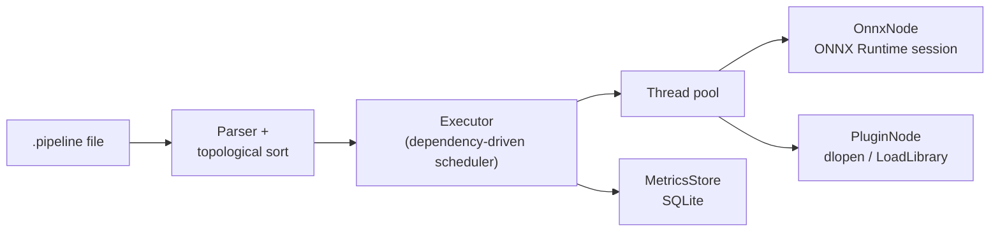
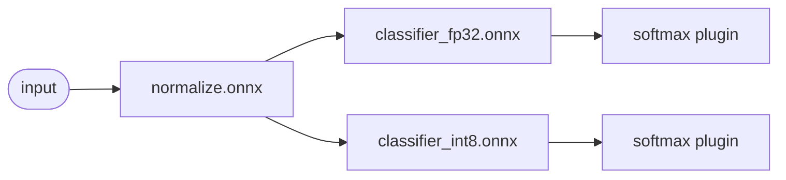

# Mini AI Orchestrator

A small C++17 runtime that executes **ML inference pipelines as a DAG** on Linux and Windows.
Each step is either an **ONNX Runtime** model or an operator **plugin** loaded at runtime from a
shared library (`.so` / `.dll`). Independent branches run **in parallel** on a thread pool, and
per-node latency is recorded to **SQLite** for performance analysis. A Python toolchain builds the
demo models and applies **INT8 dynamic quantization**.


## Architecture



Demo pipeline (`pipelines/demo.pipeline`): the FP32 and INT8 branches run concurrently.



## Features

| Area | What it does | Where |
| --- | --- | --- |
| Model loading & inference | Wraps `Ort::Session` with graph optimizations; one shared `Ort::Env`; thread-safe `Run` | `src/onnx_node.cpp` |
| Orchestration & scheduling | Kahn's algorithm validation (cycles, unknown/duplicate deps); nodes are dispatched the moment their inputs are ready; multi-input nodes get inputs concatenated on the last axis | `src/pipeline.cpp`, `src/executor.cpp` |
| Concurrency | Fixed-size worker pool; per-run state is shared-owned by tasks so no worker outlives the memory it touches (verified with ThreadSanitizer) | `src/thread_pool.cpp`, `src/executor.cpp` |
| Shared libraries | Core is a shared library with explicit symbol export (`__declspec(dllexport)` / `visibility("default")`); plugins use a C ABI and are loaded with `dlopen`/`LoadLibrary` | `include/orchestrator/export.h`, `src/plugin.cpp` |
| Quantization | ONNX Runtime dynamic INT8 quantization with size / latency / agreement report | `python/quantize.py` |
| Observability | Thread-safe leveled logger; p50/p95/max latency per node; SQLite persistence | `src/logger.cpp`, `src/metrics_store.cpp` |
| Testing & CI | 36 dependency-free unit checks via CTest; GitHub Actions on Ubuntu (GCC) and Windows (MSVC) | `tests/`, `.github/workflows/ci.yml` |

## Results (Linux x86-64 CPU, ONNX Runtime 1.20.1)

Quantization (`python/quantize.py`, batch 256, 1 thread):

| Model | Size | Latency | Top-1 agreement with FP32 |
| --- | --- | --- | --- |
| classifier FP32 | 278 KB | 0.36 ms | — |
| classifier INT8 | 73 KB (3.8× smaller) | 0.26 ms | 98.0% |

Pipeline (`orchestrator_cli`, batch 32, 100 iterations, 4 threads):

| Node | p50 latency |
| --- | --- |
| normalize | 0.036 ms |
| clf_fp32 | 0.138 ms |
| clf_int8 | 0.095 ms |
| softmax plugin | 0.003 ms |
| **end to end** | **0.454 ms** |

Numbers vary by machine; reproduce them with the commands below.

## Build and run

Prerequisites: CMake ≥ 3.16, a C++17 compiler (GCC/Clang or Visual Studio 2022), Python 3.9+,
and a prebuilt [ONNX Runtime release](https://github.com/microsoft/onnxruntime/releases).

### Linux

```bash
# 1. ONNX Runtime C/C++ package
curl -sSL https://github.com/microsoft/onnxruntime/releases/download/v1.20.1/onnxruntime-linux-x64-1.20.1.tgz | tar xz

# 2. Models (already committed; regenerate if you like)
pip install -r python/requirements.txt
python python/make_models.py && python python/quantize.py

# 3. Build, test, run
sudo apt-get install -y libsqlite3-dev   # optional, for metrics persistence
cmake -S . -B build -DCMAKE_BUILD_TYPE=Release -DONNXRUNTIME_ROOT=$PWD/onnxruntime-linux-x64-1.20.1
cmake --build build -j
ctest --test-dir build --output-on-failure
./build/bin/orchestrator_cli --pipeline pipelines/demo.pipeline --batch 32 --metrics-db metrics.db
```

### Windows (Developer PowerShell)

```powershell
Invoke-WebRequest https://github.com/microsoft/onnxruntime/releases/download/v1.20.1/onnxruntime-win-x64-1.20.1.zip -OutFile ort.zip
Expand-Archive ort.zip -DestinationPath .
cmake -S . -B build -A x64 -DONNXRUNTIME_ROOT="$PWD/onnxruntime-win-x64-1.20.1"
cmake --build build --config Release
ctest --test-dir build -C Release --output-on-failure
build\bin\orchestrator_cli.exe --pipeline pipelines/demo.pipeline
```

`onnxruntime.dll` is copied next to the executables automatically. SQLite is optional
(`-DORCH_WITH_SQLITE=OFF`); without it metrics are printed but not persisted.

## Pipeline format

```text
# node <name> type=<onnx|plugin> path=<model file or plugin name> [deps=a,b]
node normalize  type=onnx   path=../models/normalize.onnx
node clf        type=onnx   path=../models/classifier_fp32.onnx deps=normalize
node probs      type=plugin path=softmax_plugin                 deps=clf
```

Model paths are relative to the pipeline file. Plugin names resolve to `lib<name>.so` or
`<name>.dll` in `--plugin-dir` (default: the executable's folder).

## Writing a plugin

Export two C functions and build the file as a shared library (see `plugins/softmax_plugin.cpp`):

```cpp
extern "C" ORCH_PLUGIN_API const char* orch_plugin_name();
extern "C" ORCH_PLUGIN_API int orch_plugin_run(const float* in, const int64_t* shape,
                                               size_t rank, float* out);  // 0 = success
```

A C ABI keeps plugins independent of the compiler and standard library used to build the host.

## Project layout

```text
include/orchestrator/   public headers (export macros, Tensor, Node, Executor, ...)
src/                    core shared library
plugins/                example runtime-loaded operator
apps/                   orchestrator_cli
tests/                  unit tests (CTest)
python/                 model generation + INT8 quantization
pipelines/              pipeline definitions
models/                 generated ONNX models
```

## Possible extensions

- Execution providers (QNN / DirectML / CUDA) selected per node
- Multi-input / multi-output models and named tensor routing
- Batching queue for concurrent requests; cancellation and timeouts

## License

MIT
